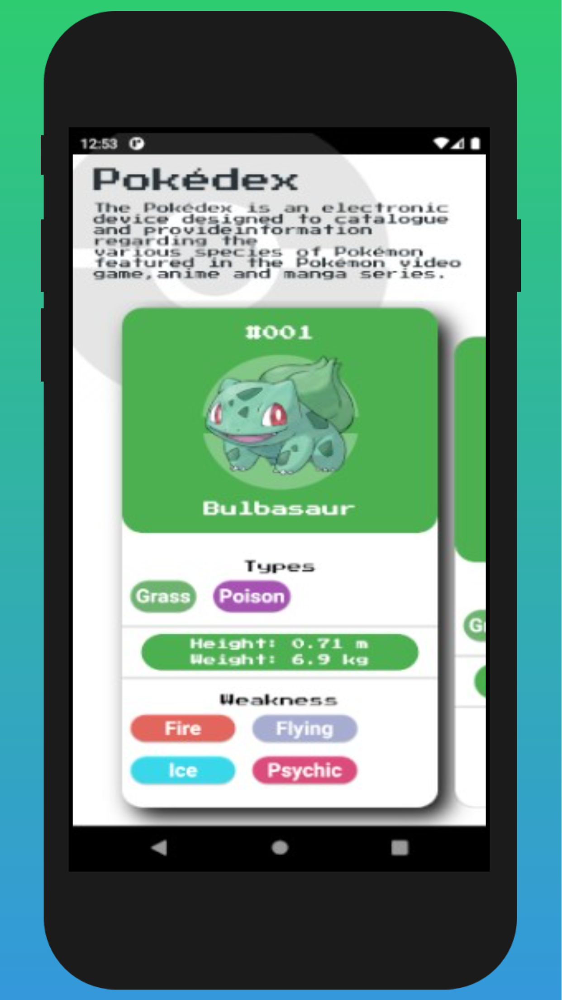

# Pokédex Flutter MobX

## Sobre:

Esse projeto serviu como uma boa base para os estudos da tecnologia de gerenciamento de estado MobX. 

Neste link, está o projeto desenvolvido sem MobX e com diferenças no design: [Pokédex Flutter API](https://github.com/feliper2002/pokedex-flutter-api)

## Screenshots da aplicação:

## Técnologias Utilizadas:

 

