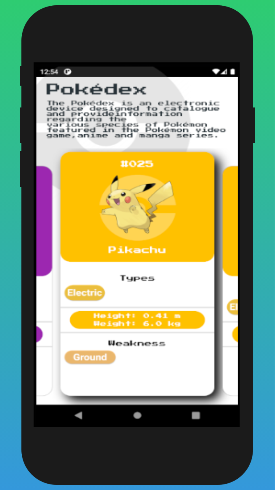
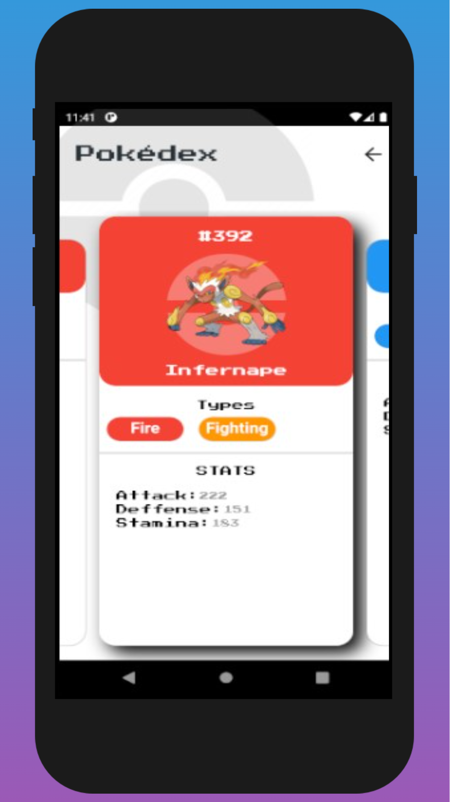
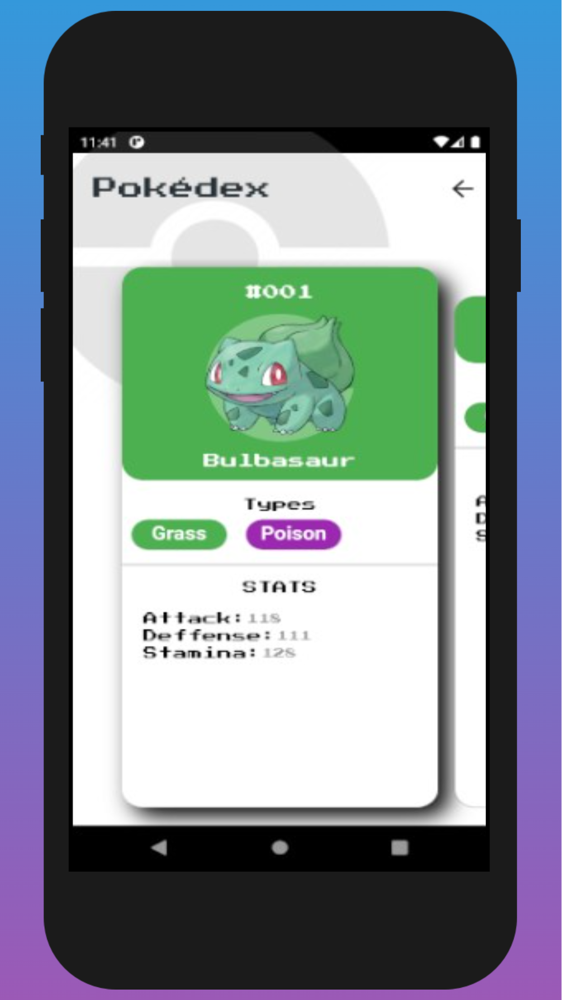
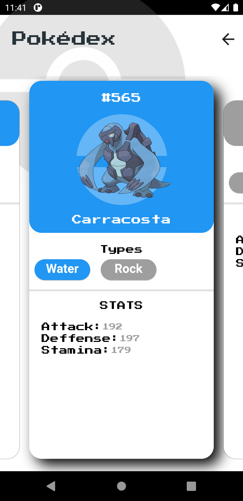
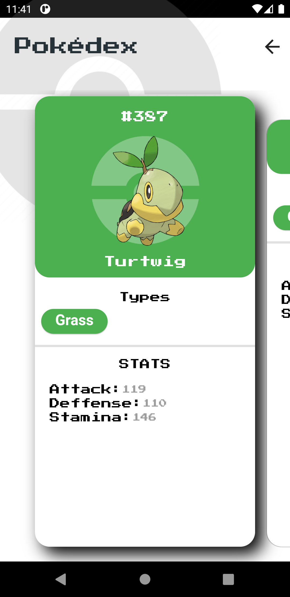
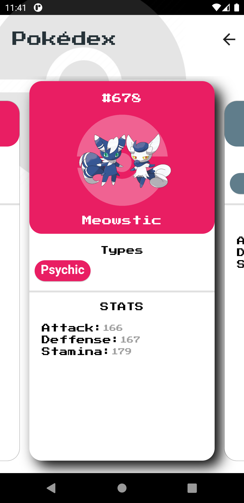

# Pokédex Flutter MobX

### v1.0.5

- [x] Background adicionado nas páginas
- [x] Pokédex completa até a 6ª geração
- [x] Algumas Mega Evoluções

### v1.0.6

- [x] Novo design das páginas e dos botões

### v1.0.7

- [x] Novo layout responsivo (apenas tela na vertical por enquanto).

## Sobre:

Esse projeto serviu como uma boa base para os estudos da tecnologia de gerenciamento de estado MobX. 

Neste link, está o projeto desenvolvido sem MobX e com diferenças no design: [Pokédex Flutter API](https://github.com/feliper2002/pokedex-flutter-api)

## Screenshots da aplicação:

## API Utilizada:

[Pokémon GO API](https://pokemon-go-lingen.github.io/pokemon-go-api/) - Repositório da API no [GitHub](https://github.com/pokemon-go-lingen/pokemon-go-api)

## Técnologias Utilizadas:

 
